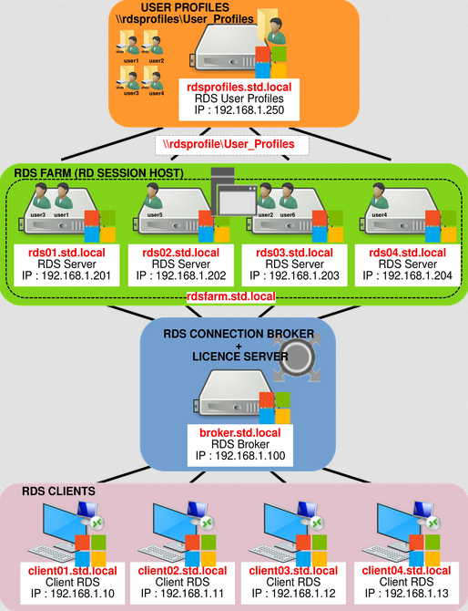
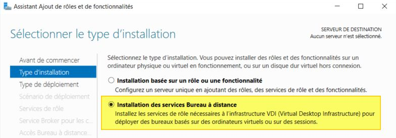

# Day 3 (2 en vrai)

# Un peu de sécurité : le principe du Tiering

Récemment (genre depuis une dizaine d'années hein), Microsoft, l'ANSSI et tous les pros dans le domaine, se sont penchés sur la problématique de **l'admin du domaine**. Avec un compte pété, un attaquant a accès à littéralement toute votre infrastructure en tant qu'admin, ce qui est une catastrophe. L'approche du Tiering **permet** de réduire le risque encouru d'un compte admin compromis en cloisonnant proprement les ressources dans un AD.

[Vous pouvez retrouver toutes les infos textuelles sur le tiering ici.]([Sécuriser Active Directory : comprendre le Tiering Model](https://www.it-connect.fr/active-directory-tiering-model-les-fondamentaux/))

## Plus de manips

🌞 Allez plus loin : sur le modèle du tiering, faites les trois tiers dans votre AD : 

🌞 Créez des comptes admins avec chacun un tier d'accès assigné en terme de nom, par exemple avec pour le tier 1 `t1-fribery` et ainsi de suite pour chaque tier

🌞 Pour sécuriser l'accès à votre AD, faites en sorte que seul un compte dans le groupe `t0` aie le droit de se connecter

- Pour faire ça, vous allez devoir passer par une GPO (et oui), on va voir ça juste en dessous

# Les GPO

Probablement le truc le plus important dans un AD, les GPO servent à donner des droits (ou restreindre) de manière granulaire les actions possibles par vos utilisateurs dans un AD. L'objet de GPO en lui-même consiste en une liste de stratégies définies et liées sur les OU. On appelle **lien** le fait d'appliquer une GPO.

> D'où le fait que dans beaucoup de cas, il est plus intéressant de créer une OU qu'un groupe, car il est plus facile de gérer une GPO pour une OU qu'un groupe

Le gestionnaire de GPO est installé avec l'AD DS et est accessible en tapant `gpedit.msc`.

Lorsque vous créez une GPO, toutes les GPO sont présents en vrac dans **Objets GPO Starter**. Celle-ci n'est par défaut pas liée à moins que vous ne l'ayez créée directement en faisant un clic droit sur l'OU concernée.
Une fois une GPO créée et liée, ses stratégies s'appliqueront sur l'OU désignée.

## Types de configuration de stratégie

Les GPO disposent de deux types d'application de stratégie : 

- Configuration ordinateur : Ces paramètres vont s'appliquer au démarrage de l'ordinateur, et uniquement sur les objets ordinateur présents dans l'OU.

- Configuration de l'utilisateur : Ces paramètres vont s'appliquer lors de la connexion de l'utilisateur sur n'importe quel poste du domaine.

Il faut savoir quand utiliser l'un ou l'autre : l'intérêt d'une politique utilisateur est de pouvoir l'appliquer absolument partout (par exemple : restriction des longueurs des mots de passe, du fond d'écran, des interdictions d'accès aux paramètres...), tandis que pour les configuration ordinateurs, on peut par exemple cibler des logiciels à installer mais uniquement sur certains PC, ou des raccourcis qu'il n'est pas nécessaire d'avoir pour tous les utilisateurs.

# Reprenons le tiering

🌞 Pour sécuriser l'accès à votre **DC**, il faut que seul les utilisateurs administrateurs du groupe `t0` puissent se connecter au DC. De ce fait : 

- Créez une **nouvelle GPO** sur l'OU **Domain controllers**

> ⚠️ Il peut être compliqué de nommer des GPO. Chacun ses goûts, mais il faut absolument qu'une GPO puisse être claire rien qu'à son nom.
> De ce fait, voici une convention de nommage que vous pouvez utiliser : 
> 
> > `<CL><C><Baseline><FA>`
> > 
> > Exemple : CL-C-BaselineConfig-FA
> > 
> > **CL**– Client machines
> > 
> > **U**– User Settings
> > 
> > **C**– Computer settings
> > 
> > **FA/FD/WMI**– Filter apply and denied. (optionnel)
> > 
> > **ST**– Site
> > 
> > **SVR**– Server
> > 
> > **DC**-Domain Controller
> 
> Ici, on peut deviner que la GPO ne concerne que les ordinateurs clients (donc pas les serveurs), et le terme **Baseline Config** fait référence à une configuration de base appliquée à tous les PC. Et FA indique l'application de règles, et non du blocage

- Cherchez et appliquez les deux stratégies suivantes (en anglais ici, faites la traduction en français) : 
  
  - **Allow log on locally***
    
    - Vous êtes forcés d'ajouter le groupe `Administrateurs`
    
    - Ajoutez votre groupe `T0-Admins`
  
  - **Allow log on through Remote Desktop Services**
    
    - Tout pareil
  
  - **Explicitly block others***
    
    - Ajoutez le groupe `Utilisateurs du domaine` pour bloquer tout le monde sauf ceux autorisés à se connecter aux DC
  
  - **Deny log on through Remote Desktop Services***
    
    - Tout pareil

🌞 Une fois la GPO créée et liée à l'OU DC, faites les tests. Avec un utilisateur du groupe T0, tentez de vous connecter sur le DC, localement ou à distance.

🌞 Tentez de faire la même avec votre compte administrateur créé au tout début dans l'OU Admin. Ça devrait marcher aussi ! D'où l'importance du tiering

🌞 Retirez votre groupe Admin de l'OU Admin du groupe `Administrateurs` du DC. Ça ne devrait plus marcher.

🌞 Avec un autre compte utilisateur, tentez une connexion au DC. Normalement impossible

---

Vous voyez donc ici l'intérêt du tiering : si un compte admin se fait péter, si c'est un compte T1 par exemple, comme il n'est pas le compte admin le plus élevé, l'attaquant ne peut pas aller directement chopper le DC.

> Ce n'est pas non plus une solution miracle : ne négligez pas le reste de la sécurité

# Les rôles d'un AD

Vous l'avez vu lors de l'ajout de rôles, il y en a plein, qui diffèrent en plus selon le niveau fonctionnel de la forêt. On va voir les plus utilisés en entreprise

## DHCP

Le but d'un serveur DHCP dans un réseau est de donner une adresse IP aux machines. Dans le contexte du domaine ici, toute machine jointe au domaine doit pouvoir bénéficier d'une IP dans une étendue donnée.

## DNS

Avec un serveur DNS, vous donnez aux postes du domaine un système de reconnaissance par nom plutôt que par IP. Il y a tout un tas d'options disponibles sur une solution Windows Server.

## RDS

RDS, ou **Remote Desktop Services**, est un système permettant à des utilisateurs d'accéder à un bureau virtuel avec une session propre à lui. Les termes RDS et **RemoteApp** sont souvent utilisés conjointement, car il est possible de lancer des applications à distance, comme si c'était un bureau, mais ne présentant que l'application.

L'installation d'un rôle RDS se fait sur un DC, et toute la gestion des droits et permissions se fait avec les GPO.

Dans une ferme RDS standard, il y a normalement plusieurs machines pour équilibrer la charge, avec un broker devant. Le broker sert entre autre de passerelle, pour rediriger les utilisateurs souhaitant ouvrir une session.

On va mettre un serveur RDS en place.

---

🌞 Sur votre DC, ajoutez le rôle RDS de type **Démarrage rapide** et basé sur **une session**.

Toutes les étapes sont disponibles ici : [Déploiement rapide d’un serveur RDS avec Windows Server 2016 | IT-Connect](https://www.it-connect.fr/deploiement-rapide-dun-serveur-rds-avec-windows-server-2016/)

Une fois le rôle installé, vous vous apercevrez que vous allez très vite être limité en nombre d'utilisateurs maximum connectés, car chaque utilisateur va vous bouffer une licence. Par connexion. De ce fait, vous allez avoir besoin d'un gestionnaire de licences.

🌞 Ajoutez le gestionnaire de licences, et corrigez les propriétés de déploiement

🌞 Enfin, suivez la suite du tutoriel pour mettre en place les sessions RDS

## Publication d'une RemoteApp
