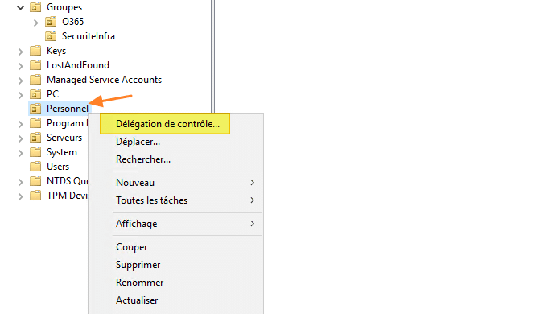

# Day 4 (mais en fait 3 enfin c'est lundi t'as capté)

# Les délégations

Le principe d'une délégation est simple : vous n'autorisez qu'à un certain groupe d'effectuer certains actions particulières sur une OU, souvent des tâches d'administration pour des utilisateurs qui ne peuvent pas se permettre d'avoir tous les droits admin possibles.
Les délégations peuvent s'appliquer sur les éléments suivants : 

- L'intégralité du domaine Active Directory
- Un site Active Directory
- Une unité d'organisation spécifique
- Un objet spécifique de l'annuaire

> Vous comprendrez bien sûr qu'il est risqué, voire inutile, de faire une délégation sur tout le domaine 

Il faut s'imaginer que ces délégations peuvent être utilisées par exemple : 

- Pour des services N1 helpdesk qui doivent créer/éditer des utilisateurs dans votre AD (les tickets là)

- Les stagiaires ou alternants pour lesquels vous voulez restreindre les actions possibles avec leur compte

- Pour les comptes de service ne faisant qu'une tâche précise

Dans notre cas, on va s'imaginer que dans votre boîte, un service support a besoin de créer et éditer des utilisateurs dans l'une de vos OU (au choix), car il y en a plein à créer chaque jour, et vous ne pouvez pas vous permettre de perdre du temps avec ça.



🌞 Créez une OU **Service support** avec à l'intérieur un groupe et un utilisateur du support dans ce groupe.

🌞 Créez une délégation : faites en sorte que l'utilisateur dans le groupe puisse voir et modifier les utilisateurs présents dans l'OU de votre choix, mais pas créer ou modifier de groupes.
Prenez un screen de l'écran résumé de la délégation.

🌞 Ajoutez le groupe comme autorisé à se connecter en RDP sur le DC.

🌞 Connectez-vous avec cet utilisateur sur la machine Windows 11 (donnez-lui les droits bureau à distance au préalable), puis en RDP sur le DC. Testez d'ouvrir la console Utilisateurs Active Directory, et d'y créer un utilisateur dans l'OU déléguée.

# Un peu de Powershell

On va faire un peu de Powershell avec un compte de service. Les comptes de service sont généralement utilisés à des fins uniques avec les droits les moins larges possibles pour réaliser des tâches récurrentes ou automatisées. Généralement à mot de passe fixe, ils n'ont pas pour but de pouvoir ouvrir de session. Ils sont également utilisés dans les tâches planifiées.

🌞 Dans l'OU **Utilisateurs Tier 2**, créez une sous-OU nommé `Services` et créez-y un groupe et un compte de service de votre choix qui servira à créer un user dans une OU donné.

🌞 Faites une délégation pour ce compte de service, pour qu'il puisse modifier des utilisateurs (mais pas des groupes).
Prenez un screen de l'écran résumé de la délégation.

🌞 Sur le PC Windows 11, créez un petit script Powershell qui prendra des paramètres dans une fonction pour venir modifier des infos d'un utilisateur dans l'OU, genre un peu comme ça :

```powershell
function CreateUser {
    param($User, $FirstName, $LastName, $Phone)

    # Faites votre code ici pour venir trouver l'utilisateur, et modifier le prénom, nom ou numéro de téléphone selon les paramètres donnés dans l'OU
Écriture des objets: 100% (5/5), 35.12 Kio | 35.12 Mio/s, fait.

}
```

🌞 Exécutez votre fonction **en tant que l'utilisateur de service (ouvrez une fenêtre Powershell en tant qu'autre utilisateur)** et vérifiez son fonctionnement. 
Si vous n'avez pas d'erreur, votre délégation a fonctionné.

🐸 Retirez à la main la délégation que vous avez faite, et relancez votre petit script avec votre compte de service. Qu'est-ce qui s'affiche ?
