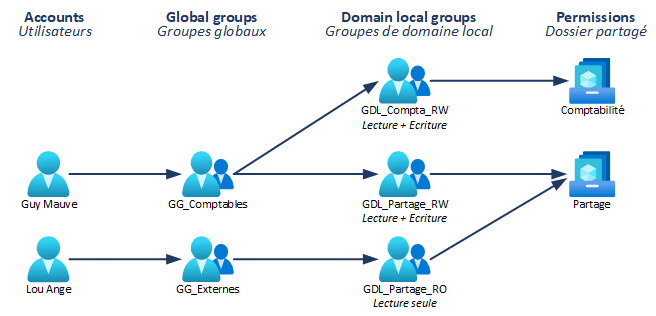

# Day 5

# Serveur de fichiers

Vous l'aurez sans doute deviné, le principe d'un serveur de fichiers est de pouvoir stocker et partager un grand nombre de fichiers, mais plus important, faire en sorte que ces fichiers puissent être accessibles dans le réseau, et cloisonnés pour ceux qui en ont besoin.
Vous n'avez pas envie que Martine de la compta puisse accéder à un dossier nommé `CONFIDENTIEL - Codes d'armement nucléaire`.

 Pour mettre en place le serveur de fichiers, assurez-vous que le rôle **Serveur de fichiers** soit bien installé sur votre DC. Vous l'avez normalement fait lors de la création de votre machine.

Mais il va aussi falloir un peu plus d'espace, sur un disque séparé. Même dans une VM, il est nécessaire d'allouer un disque dédié différent pour le stockage des fichiers.

🌞 Dans votre hyperviseur, attachez un nouveau disque à votre VM. Mettez-lui **15 Go**.

🌞 Une fois le disque placé et la machine rallumé, dans le Gestionnaire de partitions, attribuez-lui un nom et une lettre.

🌞 Dans le Gestionnaire de serveurs, catégorie Partages, créez un nouveau partage au format **SMB - Rapide**. Nommez-le comme vous voulez

🌞 N'autorisez que les utilisateurs d'un groupe d'une de vos OU à pouvoir effectuer des modifications. Donnez uniquement un accès en lecture aux autres groupes.

🌞 Testez l'accès au partage. Sur le PC Windows 11, connectez-vous avec un utilisateur ayant le droit de faire des modifications au partage `\\\NOMDUDC\nompartage`, et créez un fichier

🌞 Connectez-vous avec un autre utilisateur avec uniquement un droit de lecture, puis tentez sur ce partage de renommer le fichier. Que se passe-t-il ?

# ADGLP

Pour éviter que la gestion des droits soit le bordel, des principes existent avec des normes plus ou moins définies pour rentre les autorisations d'accès dans les partages gérables. Ce principe s'appelle l'**ADGLP**, ou **A**ccount **G**lobal **D**omain **L**ocal **P**ermissions, qui correspond à un ordre d'ajout des utilisateurs dans un groupe.

Vous pouvez retrouver toutes les infos sur le principe d'ADGLP [ici]([AGDLP - Bien gérer les droits de son serveur de fichiers](https://www.it-connect.fr/agdlp-bien-gerer-les-permissions-de-son-serveur-de-fichiers/))

Dans le principe, on est sur le schéma suivant : 

- Dans une OU de groupes, vous créez un groupe nommé **GG_NomGroupe**

- Vous créez également un deuxième groupe qui correspond à une ACL, à nommer **GDL_NomPartage** avec comme suffixe ***RO*** ou ***RW*** pour signifier un droit de lecture ou d'écriture

- C'est ce dernier groupe qui sera appliqué sur les répertoires de partage pour signifier les accès des utilisateurs.

Et à la fin, c'est les utilisateurs que vous placez dans les groupes en **GG_**, et c'est ces groupes en **GG_** que vous placez en tant que membre dans les groupes **GDL_**. Le schéma final doit ressembler à ça :  

C'est plus facile à comprendre en manipulant pour le coup

> Pour cette partie, assurez-vous d'avoir dans votre AD **au moins 2 OUs** avec dans chacune au moins un utilisateur

🌞 Dans votre partage précédemment créé, créez un nouveau dossier. Nommez-le comme vous voulez

🌞 Dans votre AD, respectez le principe d'ADGLP en créant les GG et GDL nécessaires. Puis, choisissez une de vos deux OU qui n'aura qu'un accès en lecture, et l'autre l'accès en lecture/écriture.

🌞 Appliquez les accès demandés, et ajoutez chaque utilisateur dans son groupe, de manière à ce qu'au final, un seul des deux utilisateurs puisse tout modifier dans le dossier

🌞 Connectez-vous avec l'utilisateur ayant full access sur le PC Windows 11, puis rendez-vous dans le partage à l'emplacement `\\\NOMDUDC\nompartage`, puis dans le dossier créé. Tentez de créer un fichier texte. Que se passe-t-il ?

🌞 Changez d'utilisateur et connectez-vous avec le second, qui n'a que des droits de lecture. Sur le partage, tentez de renommer le fichier. Que se passe-t-il ?

🐸 Montrez à quoi ressemble l'onglet Sécurité du dossier 
